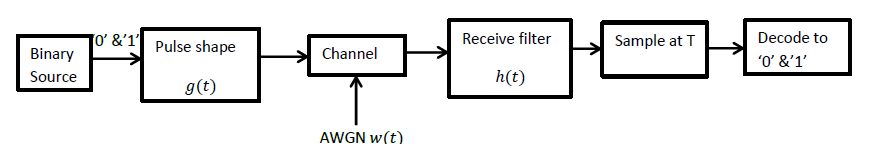
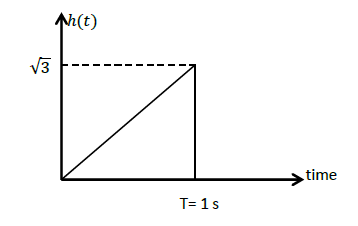
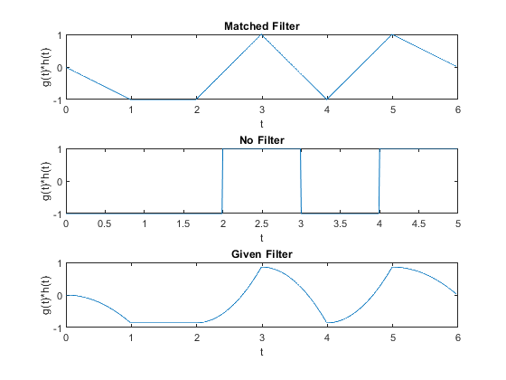
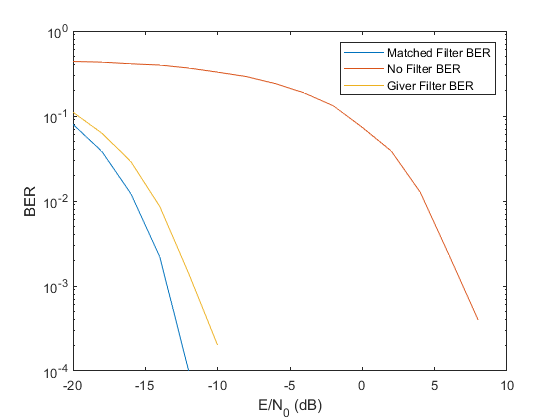

# Digital Communication System

This is a school assignment to simulate digital communication system 
done by me and [Kareem Osama](https://github.com/KareemOsamaSobeih)  
It contains an implementation for the digital communication system represented by the following diagram


## The performed steps
1. There is a binary source that generate a series of random bits
2. These random bits are represented by [Bipolar NRZ](https://en.wikipedia.org/wiki/Non-return-to-zero#Bipolar_non-return-to-zero_level) line code
3. The channel add white gaussian noise with variance N_0/2
4. There are three types of filters used :
   1. matched filter (which is the optimal filter)
   2. delta filter (the filter is not existent)
   3. This filter h(t) that has the following impulse response  
    

5. Sampling at time T = 1 is done.
6. Decode by deciding whether the sampled bit is '0' if the value is below 0 or '1' otherwise

## The code
This is just a [function](rect.m) to generate the rectangle pulse shape.
that is from 0 to 1 = 1, and 0 otherwise.
```matlab
function y = rect(t)
    y = (t >= 0).*(t <= 1);
end
```

This [function](pulse_shape.m) to transform the random bits to the pulse shape, where '0' is
represented by -1 and '1' is represented by 1
```matlab
function signal = pulse_shape(bits, n,dt)
    signal = zeros(1, n/dt);
    for i = 0:n-1
        if bits(i+1) == 0
            signal(i/dt+1:(i+1)/dt) = -1.*rect(0:dt:1-dt);
        else
            signal(i/dt+1:(i+1)/dt) = rect(0:dt:1-dt);
        end
    end
end
```
This [function](sample.m) to sample the convolved signal at time T = 1
```matlab
function output = sample(signal, n, dt)
    output = zeros(1, n);
    for i = 1:n
        output(i) = signal(i/dt);
    end
end
```
This [function](decode.m) to decode (decide whether the sampled bit is '0' if the value is
below 0 or '1' otherwise)
```matlab
function y = decode(t)
    y = (t >= 0);
end
```
This function to generate the 3rd filter that has the impulse response stated above
```matlab
function y = givenFilter(t)
    y = sqrt(3).*t.*(t >= 0).*(t <= 1);
end
```
The code that simulate the whole system can be found [here](DCSystem.m)

## Results
This is the output of convolving input signal with Receiving filters  


This is the plot of bit error rate (BER) vs E/N_0 (Energy of the input signal / variance of noise):  
  
It's obvious that the matched filter has the lowest BER because it's the optimal filter
